# ormsgpack


ormsgpack is a fast msgpack library for Python. It is a fork/reboot of [orjson](https://github.com/ijl/orjson)
It serializes faster than [msgpack-python](https://github.com/msgpack/msgpack-python) and deserializes a bit slower (right now).
It supports serialization of:
[dataclass](https://github.com/aviramha/ormsgpack#dataclass),
[datetime](https://github.com/aviramha/ormsgpack#datetime),
[numpy](https://github.com/aviramha/ormsgpack#numpy),
[pydantic](https://github.com/avirmaha/ormsgpack#OPT_SERIALIZE_PYDANTIC) and
[UUID](https://github.com/aviramha/ormsgpack#uuid) instances natively.

Its features and drawbacks compared to other Python msgpack libraries:

* serializes `dataclass` instances natively.
* serializes `datetime`, `date`, and `time` instances to RFC 3339 format,
e.g., "1970-01-01T00:00:00+00:00"
* serializes `numpy.ndarray` instances natively and faster.
* serializes `pydantic.BaseModel` instances natively (disregards the configuration ATM).
* serializes arbitrary types using a `default` hook

ormsgpack supports CPython 3.6, 3.7, 3.8, 3.9, and 3.10. ormsgpack does not support PyPy. Releases follow semantic
versioning and serializing a new object type without an opt-in flag is
considered a breaking change.

ormsgpack is licensed under both the Apache 2.0 and MIT licenses. The
repository and issue tracker is
[github.com/aviramha/ormsgpack](https://github.com/aviramha/ormsgpack), and patches may be
submitted there. There is a
[CHANGELOG](https://github.com/aviramha/ormsgpack/blob/master/CHANGELOG.md)
available in the repository.

1. [Usage](https://github.com/aviramha/ormsgpack#usage)
    1. [Install](https://github.com/aviramha/ormsgpack#install)
    2. [Quickstart](https://github.com/aviramha/ormsgpack#quickstart)
    4. [Serialize](https://github.com/aviramha/ormsgpack#serialize)
        1. [default](https://github.com/aviramha/ormsgpack#default)
        2. [option](https://github.com/aviramha/ormsgpack#option)
    5. [Deserialize](https://github.com/aviramha/ormsgpack#deserialize)
2. [Types](https://github.com/aviramha/ormsgpack#types)
    1. [dataclass](https://github.com/aviramha/ormsgpack#dataclass)
    2. [datetime](https://github.com/aviramha/ormsgpack#datetime)
    3. [enum](https://github.com/aviramha/ormsgpack#enum)
    4. [float](https://github.com/aviramha/ormsgpack#float)
    5. [int](https://github.com/aviramha/ormsgpack#int)
    6. [numpy](https://github.com/aviramha/ormsgpack#numpy)
    7. [uuid](https://github.com/aviramha/ormsgpack#uuid)
    8. [pydantic](https://github.com/aviramha/ormsgpack#pydantic)
3. [Latency](https://github.com/aviramha/ormsgpack#latency)
4. [Questions](https://github.com/aviramha/ormsgpack#questions)
5. [Packaging](https://github.com/aviramha/ormsgpack#packaging)
6. [License](https://github.com/aviramha/ormsgpack#license)

## Usage

### Install

To install a wheel from PyPI:

```sh
pip install --upgrade "pip>=19.3" # manylinux2014 support
pip install --upgrade ormsgpack
```

Notice that Linux environments with a `pip` version shipped in 2018 or earlier
must first upgrade `pip` to support `manylinux2014` wheels.

To build a wheel, see [packaging](https://github.com/aviramha/ormsgpack#packaging).

### Quickstart

This is an example of serializing, with options specified, and deserializing:

```python
>>> import ormsgpack, datetime, numpy
>>> data = {
    "type": "job",
    "created_at": datetime.datetime(1970, 1, 1),
    "status": "🆗",
    "payload": numpy.array([[1, 2], [3, 4]]),
}
>>> ormsgpack.packb(data, option=ormsgpack.OPT_NAIVE_UTC | ormsgpack.OPT_SERIALIZE_NUMPY)
b'\x84\xa4type\xa3job\xaacreated_at\xb91970-01-01T00:00:00+00:00\xa6status\xa4\xf0\x9f\x86\x97\xa7payload\x92\x92\x01\x02\x92\x03\x04'
>>> ormsgpack.unpackb(_)
{'type': 'job', 'created_at': '1970-01-01T00:00:00+00:00', 'status': '🆗', 'payload': [[1, 2], [3, 4]]}
```

### Serialize

```python
def packb(
    __obj: Any,
    default: Optional[Callable[[Any], Any]] = ...,
    option: Optional[int] = ...,
) -> bytes: ...
```

`packb()` serializes Python objects to msgpack.

It natively serializes
`bytes`, `str`, `dict`, `list`, `tuple`, `int`, `float`, `bool`,
`dataclasses.dataclass`, `typing.TypedDict`, `datetime.datetime`,
`datetime.date`, `datetime.time`, `uuid.UUID`, `numpy.ndarray`, and
`None` instances. It supports arbitrary types through `default`. It
serializes subclasses of `str`, `int`, `dict`, `list`,
`dataclasses.dataclass`, and `enum.Enum`. It does not serialize subclasses
of `tuple` to avoid serializing `namedtuple` objects as arrays. To avoid
serializing subclasses, specify the option `ormsgpack.OPT_PASSTHROUGH_SUBCLASS`.

The output is a `bytes` object containing UTF-8.

The global interpreter lock (GIL) is held for the duration of the call.

It raises `MsgpackEncodeError` on an unsupported type. This exception message
describes the invalid object with the error message
`Type is not JSON serializable: ...`. To fix this, specify
[default](https://github.com/aviramha/ormsgpack#default).

It raises `MsgpackEncodeError` on a `str` that contains invalid UTF-8.

It raises `MsgpackEncodeError` if a `dict` has a key of a type other than `str` or `bytes`,
unless `OPT_NON_STR_KEYS` is specified.

It raises `MsgpackEncodeError` if the output of `default` recurses to handling by
`default` more than 254 levels deep.

It raises `MsgpackEncodeError` on circular references.

It raises `MsgpackEncodeError`  if a `tzinfo` on a datetime object is
unsupported.

`MsgpackEncodeError` is a subclass of `TypeError`. This is for compatibility
with the standard library.

#### default

To serialize a subclass or arbitrary types, specify `default` as a
callable that returns a supported type. `default` may be a function,
lambda, or callable class instance. To specify that a type was not
handled by `default`, raise an exception such as `TypeError`.

```python
>>> import ormsgpack, decimal
>>>
def default(obj):
    if isinstance(obj, decimal.Decimal):
        return str(obj)
    raise TypeError

>>> ormsgpack.packb(decimal.Decimal("0.0842389659712649442845"))
MsgpackEncodeError: Type is not JSON serializable: decimal.Decimal
>>> ormsgpack.packb(decimal.Decimal("0.0842389659712649442845"), default=default)
b'\xb80.0842389659712649442845'
>>> ormsgpack.packb({1, 2}, default=default)
ormsgpack.MsgpackEncodeError: Type is not msgpack serializable: set
```

The `default` callable may return an object that itself
must be handled by `default` up to 254 times before an exception
is raised.

It is important that `default` raise an exception if a type cannot be handled.
Python otherwise implicitly returns `None`, which appears to the caller
like a legitimate value and is serialized:

```python
>>> import ormsgpack, json, rapidjson
>>>
def default(obj):
    if isinstance(obj, decimal.Decimal):
        return str(obj)

>>> ormsgpack.unpackb(ormsgpack.packb({"set":{1, 2}}, default=default))
{'set': None}
```

#### option

To modify how data is serialized, specify `option`. Each `option` is an integer
constant in `ormspgack`. To specify multiple options, mask them together, e.g.,
`option=ormspgack.OPT_NON_STR_KEYS | ormspgack.OPT_NAIVE_UTC`.

##### OPT_NAIVE_UTC

Serialize `datetime.datetime` objects without a `tzinfo` as UTC. This
has no effect on `datetime.datetime` objects that have `tzinfo` set.

```python
>>> import ormsgpack, datetime
>>> ormsgpack.unpackb(ormsgpack.packb(
        datetime.datetime(1970, 1, 1, 0, 0, 0),
    ))
"1970-01-01T00:00:00"
>>> ormsgpack.unpackb(ormsgpack.packb(
        datetime.datetime(1970, 1, 1, 0, 0, 0),
        option=ormsgpack.OPT_NAIVE_UTC,
    ))
"1970-01-01T00:00:00+00:00"
```

##### OPT_NON_STR_KEYS

Serialize `dict` keys of type other than `str`. This allows `dict` keys
to be one of `str`, `int`, `float`, `bool`, `None`, `datetime.datetime`,
`datetime.date`, `datetime.time`, `enum.Enum`, and `uuid.UUID`. For comparison,
the standard library serializes `str`, `int`, `float`, `bool` or `None` by
default.

```python
>>> import ormsgpack, datetime, uuid
>>> ormsgpack.packb(
        {uuid.UUID("7202d115-7ff3-4c81-a7c1-2a1f067b1ece"): [1, 2, 3]},
        option=ormsgpack.OPT_NON_STR_KEYS,
    )
>>> ormsgpack.packb(
        {datetime.datetime(1970, 1, 1, 0, 0, 0): [1, 2, 3]},
        option=ormsgpack.OPT_NON_STR_KEYS | ormsgpack.OPT_NAIVE_UTC,
    )
```

These types are generally serialized how they would be as
values, e.g., `datetime.datetime` is still an RFC 3339 string and respects
options affecting it.

This option has the risk of creating duplicate keys. This is because non-`str`
objects may serialize to the same `str` as an existing key, e.g.,
`{"1970-01-01T00:00:00+00:00": true, datetime.datetime(1970, 1, 1, 0, 0, 0): false}`.
The last key to be inserted to the `dict` will be serialized last and a msgpack deserializer will presumably take the last
occurrence of a key (in the above, `false`). The first value will be lost.

##### OPT_OMIT_MICROSECONDS

Do not serialize the `microsecond` field on `datetime.datetime` and
`datetime.time` instances.

```python
>>> import ormsgpack, datetime
>>> ormsgpack.packb(
        datetime.datetime(1970, 1, 1, 0, 0, 0, 1),
    )
>>> ormsgpack.packb(
        datetime.datetime(1970, 1, 1, 0, 0, 0, 1),
        option=ormsgpack.OPT_OMIT_MICROSECONDS,
    )
```

##### OPT_PASSTHROUGH_DATACLASS

Passthrough `dataclasses.dataclass` instances to `default`. This allows
customizing their output but is much slower.


```python
>>> import ormsgpack, dataclasses
>>>
@dataclasses.dataclass
class User:
    id: str
    name: str
    password: str

def default(obj):
    if isinstance(obj, User):
        return {"id": obj.id, "name": obj.name}
    raise TypeError

>>> ormsgpack.packb(User("3b1", "asd", "zxc"))
b'\x83\xa2id\xa33b1\xa4name\xa3asd\xa8password\xa3zxc'
>>> ormsgpack.packb(User("3b1", "asd", "zxc"), option=ormsgpack.OPT_PASSTHROUGH_DATACLASS)
TypeError: Type is not msgpack serializable: User
>>> ormsgpack.packb(
        User("3b1", "asd", "zxc"),
        option=ormsgpack.OPT_PASSTHROUGH_DATACLASS,
        default=default,
    )
b'\x82\xa2id\xa33b1\xa4name\xa3asd'
```

##### OPT_PASSTHROUGH_DATETIME

Passthrough `datetime.datetime`, `datetime.date`, and `datetime.time` instances
to `default`. This allows serializing datetimes to a custom format, e.g.,
HTTP dates:

```python
>>> import ormsgpack, datetime
>>>
def default(obj):
    if isinstance(obj, datetime.datetime):
        return obj.strftime("%a, %d %b %Y %H:%M:%S GMT")
    raise TypeError

>>> ormsgpack.packb({"created_at": datetime.datetime(1970, 1, 1)})
b'\x81\xaacreated_at\xb31970-01-01T00:00:00'
>>> ormsgpack.packb({"created_at": datetime.datetime(1970, 1, 1)}, option=ormsgpack.OPT_PASSTHROUGH_DATETIME)
TypeError: Type is not msgpack serializable: datetime.datetime
>>> ormsgpack.packb(
        {"created_at": datetime.datetime(1970, 1, 1)},
        option=ormsgpack.OPT_PASSTHROUGH_DATETIME,
        default=default,
    )
b'\x81\xaacreated_at\xbdThu, 01 Jan 1970 00:00:00 GMT'
```

This does not affect datetimes in `dict` keys if using OPT_NON_STR_KEYS.

##### OPT_PASSTHROUGH_SUBCLASS

Passthrough subclasses of builtin types to `default`.

```python
>>> import ormsgpack
>>>
class Secret(str):
    pass

def default(obj):
    if isinstance(obj, Secret):
        return "******"
    raise TypeError

>>> ormsgpack.packb(Secret("zxc"))
b'\xa3zxc'
>>> ormsgpack.packb(Secret("zxc"), option=ormsgpack.OPT_PASSTHROUGH_SUBCLASS)
TypeError: Type is not msgpack serializable: Secret
>>> ormsgpack.packb(Secret("zxc"), option=ormsgpack.OPT_PASSTHROUGH_SUBCLASS, default=default)
b'\xa6******'
```

This does not affect serializing subclasses as `dict` keys if using
OPT_NON_STR_KEYS.

##### OPT_SERIALIZE_NUMPY

Serialize `numpy.ndarray` instances. For more, see
[numpy](https://github.com/aviramha/ormsgpack#numpy).

##### OPT_SERIALIZE_PYDANTIC
Serialize `pydantic.BaseModel` instances. Right now it ignores the config (str transformations), support might be added
later.
##### OPT_UTC_Z

Serialize a UTC timezone on `datetime.datetime` instances as `Z` instead
of `+00:00`.

```python
>>> import ormsgpack, datetime
>>> ormsgpack.packb(
        datetime.datetime(1970, 1, 1, 0, 0, 0, tzinfo=datetime.timezone.utc),
    )
b'"1970-01-01T00:00:00+00:00"'
>>> ormsgpack.packb(
        datetime.datetime(1970, 1, 1, 0, 0, 0, tzinfo=datetime.timezone.utc),
        option=ormsgpack.OPT_UTC_Z
    )
b'"1970-01-01T00:00:00Z"'
```

### Deserialize
```python
def unpackb(__obj: Union[bytes, bytearray, memoryview], / , option=None) -> Any: ...
```

`unpackb()` deserializes msgpack to Python objects. It deserializes to `dict`,
`list`, `int`, `float`, `str`, `bool`, `bytes` and `None` objects.

`bytes`, `bytearray`, `memoryview` input are accepted.

ormsgpack maintains a cache of map keys for the duration of the process. This
causes a net reduction in memory usage by avoiding duplicate strings. The
keys must be at most 64 bytes to be cached and 512 entries are stored.

The global interpreter lock (GIL) is held for the duration of the call.

It raises `MsgpackDecodeError` if given an invalid type or invalid
msgpack.

`MsgpackDecodeError` is a subclass of `ValueError`.

#### option
`unpackb()` supports the `OPT_NON_STR_KEYS` option, that is similar to original msgpack's `strict_map_keys=False`.
Be aware that this option is considered unsafe and disabled by default in msgpack due to possibility of HashDoS.

## Types

### dataclass

ormsgpack serializes instances of `dataclasses.dataclass` natively. It serializes
instances 40-50x as fast as other libraries and avoids a severe slowdown seen
in other libraries compared to serializing `dict`.

It is supported to pass all variants of dataclasses, including dataclasses
using `__slots__`, frozen dataclasses, those with optional or default
attributes, and subclasses. There is a performance benefit to not
using `__slots__`.

Dataclasses are serialized as maps, with every attribute serialized and in
the order given on class definition:

```python
>>> import dataclasses, ormsgpack, typing

@dataclasses.dataclass
class Member:
    id: int
    active: bool = dataclasses.field(default=False)

@dataclasses.dataclass
class Object:
    id: int
    name: str
    members: typing.List[Member]

>>> ormsgpack.packb(Object(1, "a", [Member(1, True), Member(2)]))
b'\x83\xa2id\x01\xa4name\xa1a\xa7members\x92\x82\xa2id\x01\xa6active\xc3\x82\xa2id\x02\xa6active\xc2'
```
Users may wish to control how dataclass instances are serialized, e.g.,
to not serialize an attribute or to change the name of an
attribute when serialized. ormsgpack may implement support using the
metadata mapping on `field` attributes,
e.g., `field(metadata={"json_serialize": False})`, if use cases are clear.

#### Performance
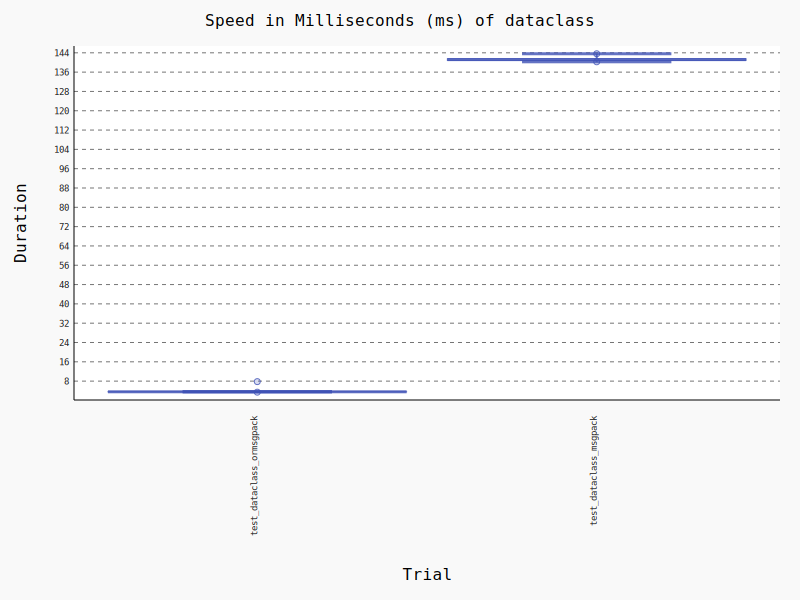

```
--------------------------------------------------------------------------------- benchmark 'dataclass': 2 tests --------------------------------------------------------------------------------
Name (time in ms)                 Min                 Max                Mean            StdDev              Median               IQR            Outliers       OPS            Rounds  Iterations
-------------------------------------------------------------------------------------------------------------------------------------------------------------------------------------------------
test_dataclass_ormsgpack       3.4248 (1.0)        7.7949 (1.0)        3.6266 (1.0)      0.3293 (1.0)        3.5815 (1.0)      0.0310 (1.0)          4;34  275.7434 (1.0)         240           1
test_dataclass_msgpack       140.2774 (40.96)    143.6087 (18.42)    141.3847 (38.99)    1.0038 (3.05)     141.1823 (39.42)    0.7304 (23.60)         2;1    7.0729 (0.03)          8           1
-------------------------------------------------------------------------------------------------------------------------------------------------------------------------------------------------
```

### datetime

ormsgpack serializes `datetime.datetime` objects to
[RFC 3339](https://tools.ietf.org/html/rfc3339) format,
e.g., "1970-01-01T00:00:00+00:00". This is a subset of ISO 8601 and
compatible with `isoformat()` in the standard library.

```python
>>> import ormsgpack, datetime, zoneinfo
>>> ormsgpack.packb(
    datetime.datetime(2018, 12, 1, 2, 3, 4, 9, tzinfo=zoneinfo.ZoneInfo('Australia/Adelaide'))
)
>>> ormsgpack.unpackb(_)
"2018-12-01T02:03:04.000009+10:30"
>>> ormsgpack.packb(
    datetime.datetime.fromtimestamp(4123518902).replace(tzinfo=datetime.timezone.utc)
)
>>> ormsgpack.unpackb(_)
"2100-09-01T21:55:02+00:00"
>>> ormsgpack.packb(
    datetime.datetime.fromtimestamp(4123518902)
)
>>> ormsgpack.unpackb(_)
"2100-09-01T21:55:02"
```

`datetime.datetime` supports instances with a `tzinfo` that is `None`,
`datetime.timezone.utc`, a timezone instance from the python3.9+ `zoneinfo`
module, or a timezone instance from the third-party `pendulum`, `pytz`, or
`dateutil`/`arrow` libraries.

`datetime.time` objects must not have a `tzinfo`.

```python
>>> import ormsgpack, datetime
>>> ormsgpack.packb(datetime.time(12, 0, 15, 290))
>>> ormsgpack.unpackb(_)
"12:00:15.000290"
```

`datetime.date` objects will always serialize.

```python
>>> import ormsgpack, datetime
>>> ormsgpack.packb(datetime.date(1900, 1, 2))
>>> ormsgpack.unpackb(_)
"1900-01-02"
```

Errors with `tzinfo` result in `MsgpackEncodeError` being raised.

It is faster to have ormsgpack serialize datetime objects than to do so
before calling `packb()`. If using an unsupported type such as
`pendulum.datetime`, use `default`.

To disable serialization of `datetime` objects specify the option
`ormsgpack.OPT_PASSTHROUGH_DATETIME`.

To use "Z" suffix instead of "+00:00" to indicate UTC ("Zulu") time, use the option
`ormsgpack.OPT_UTC_Z`.

To assume datetimes without timezone are UTC, se the option `ormsgpack.OPT_NAIVE_UTC`.

### enum

ormsgpack serializes enums natively. Options apply to their values.

```python
>>> import enum, datetime, ormsgpack
>>>
class DatetimeEnum(enum.Enum):
    EPOCH = datetime.datetime(1970, 1, 1, 0, 0, 0)
>>> ormsgpack.packb(DatetimeEnum.EPOCH)
>>> ormsgpack.unpackb(_)
"1970-01-01T00:00:00"
>>> ormsgpack.packb(DatetimeEnum.EPOCH, option=ormsgpack.OPT_NAIVE_UTC)
>>> ormsgpack.unpackb(_)
"1970-01-01T00:00:00+00:00"
```

Enums with members that are not supported types can be serialized using
`default`:

```python
>>> import enum, ormsgpack
>>>
class Custom:
    def __init__(self, val):
        self.val = val

def default(obj):
    if isinstance(obj, Custom):
        return obj.val
    raise TypeError

class CustomEnum(enum.Enum):
    ONE = Custom(1)

>>> ormsgpack.packb(CustomEnum.ONE, default=default)
>>> ormsgpack.unpackb(_)
1
```

### float

ormsgpack serializes and deserializes double precision floats with no loss of
precision and consistent rounding.

### int

ormsgpack serializes and deserializes 64-bit integers by default. The range
supported is a signed 64-bit integer's minimum (-9223372036854775807) to
an unsigned 64-bit integer's maximum (18446744073709551615).

### numpy

ormsgpack natively serializes `numpy.ndarray` and individual `numpy.float64`,
`numpy.float32`, `numpy.int64`, `numpy.int32`, `numpy.int8`, `numpy.uint64`,
`numpy.uint32`, and `numpy.uint8` instances. Arrays may have a
`dtype` of `numpy.bool`, `numpy.float32`, `numpy.float64`, `numpy.int32`,
`numpy.int64`, `numpy.uint32`, `numpy.uint64`, `numpy.uintp`, or `numpy.intp`.
ormsgpack is faster than all compared libraries at serializing
numpy instances. Serializing numpy data requires specifying
`option=ormsgpack.OPT_SERIALIZE_NUMPY`.

```python
>>> import ormsgpack, numpy
>>> ormsgpack.packb(
        numpy.array([[1, 2, 3], [4, 5, 6]]),
        option=ormsgpack.OPT_SERIALIZE_NUMPY,
)
>>> ormsgpack.unpackb(_)
[[1,2,3],[4,5,6]]
```

The array must be a contiguous C array (`C_CONTIGUOUS`) and one of the
supported datatypes.

If an array is not a contiguous C array or contains an supported datatype,
ormsgpack falls through to `default`. In `default`, `obj.tolist()` can be
specified. If an array is malformed, which is not expected,
`ormsgpack.MsgpackEncodeError` is raised.

#### Performance
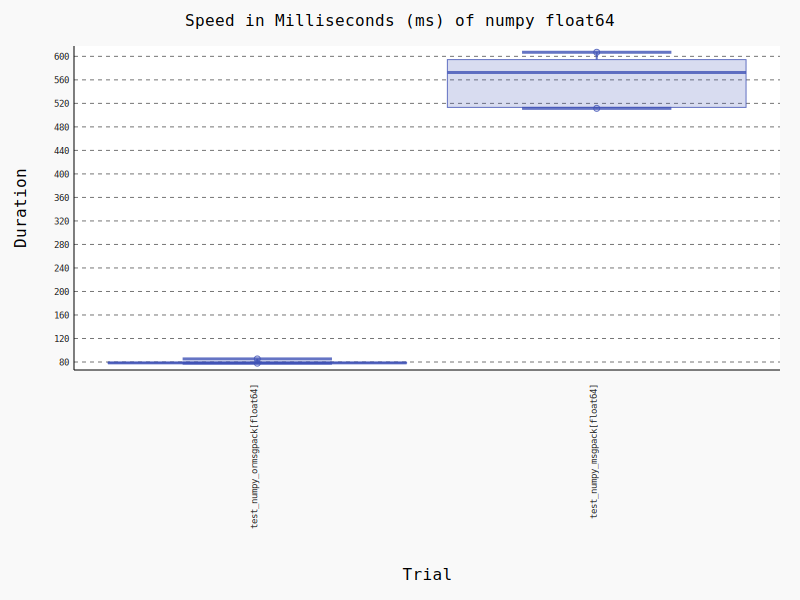
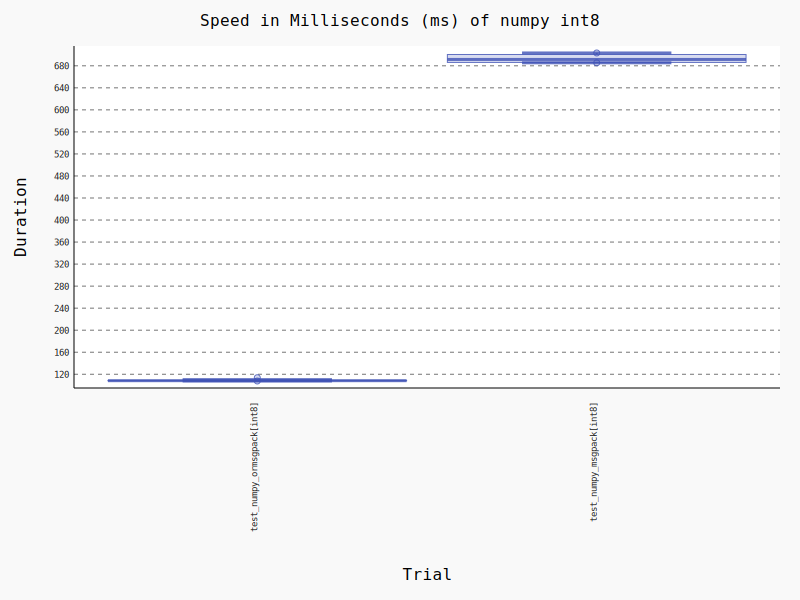
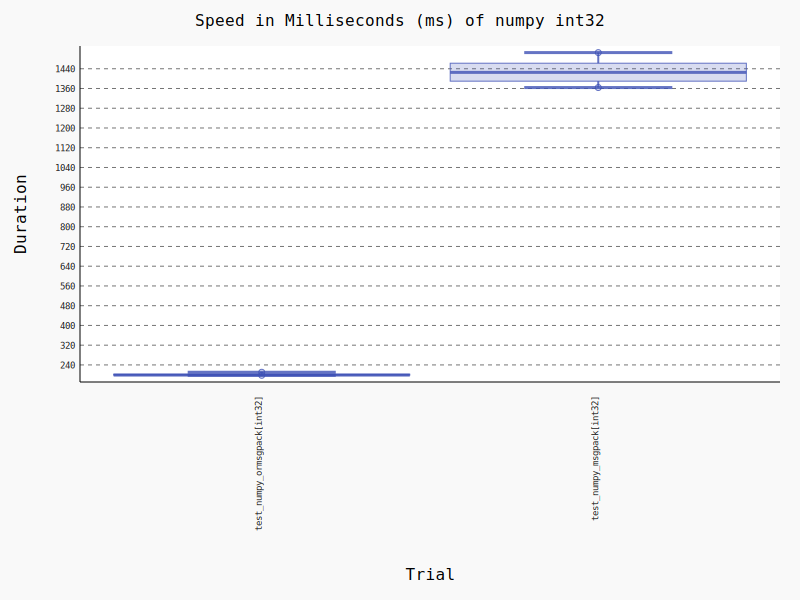
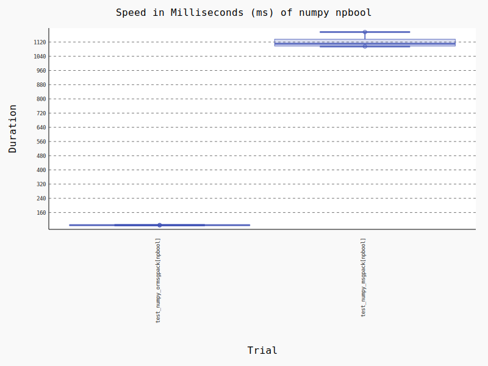
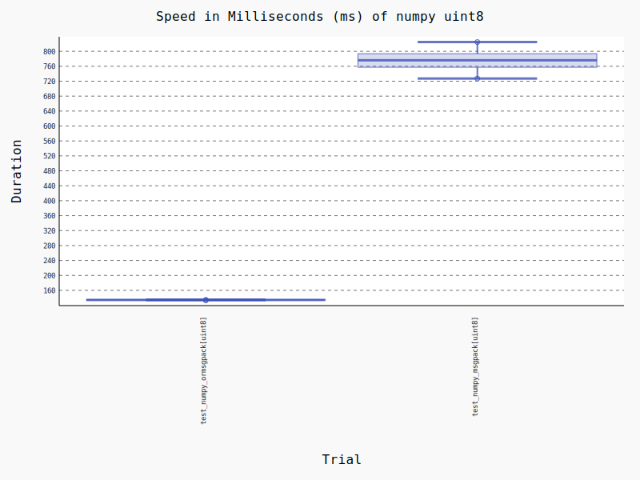
```
---------------------------------------------------------------------------------- benchmark 'numpy float64': 2 tests ---------------------------------------------------------------------------------
Name (time in ms)                      Min                 Max                Mean             StdDev              Median                IQR            Outliers      OPS            Rounds  Iterations
-------------------------------------------------------------------------------------------------------------------------------------------------------------------------------------------------------
test_numpy_ormsgpack[float64]      77.9625 (1.0)       85.2507 (1.0)       79.0326 (1.0)       1.9043 (1.0)       78.5505 (1.0)       0.7408 (1.0)           1;1  12.6530 (1.0)          13           1
test_numpy_msgpack[float64]       511.5176 (6.56)     606.9395 (7.12)     559.0017 (7.07)     44.0661 (23.14)    572.5499 (7.29)     81.2972 (109.75)        3;0   1.7889 (0.14)          5           1
-------------------------------------------------------------------------------------------------------------------------------------------------------------------------------------------------------


------------------------------------------------------------------------------------- benchmark 'numpy int32': 2 tests -------------------------------------------------------------------------------------
Name (time in ms)                      Min                   Max                  Mean             StdDev                Median                IQR            Outliers     OPS            Rounds  Iterations
------------------------------------------------------------------------------------------------------------------------------------------------------------------------------------------------------------
test_numpy_ormsgpack[int32]       197.8751 (1.0)        210.3111 (1.0)        201.1033 (1.0)       5.1886 (1.0)        198.8518 (1.0)       3.8297 (1.0)           1;1  4.9726 (1.0)           5           1
test_numpy_msgpack[int32]       1,363.8515 (6.89)     1,505.4747 (7.16)     1,428.2127 (7.10)     53.4176 (10.30)    1,425.3516 (7.17)     72.8064 (19.01)         2;0  0.7002 (0.14)          5           1
------------------------------------------------------------------------------------------------------------------------------------------------------------------------------------------------------------


-------------------------------------------------------------------------------- benchmark 'numpy int8': 2 tests ---------------------------------------------------------------------------------
Name (time in ms)                   Min                 Max                Mean            StdDev              Median                IQR            Outliers     OPS            Rounds  Iterations
--------------------------------------------------------------------------------------------------------------------------------------------------------------------------------------------------
test_numpy_ormsgpack[int8]     107.8013 (1.0)      113.7336 (1.0)      109.0364 (1.0)      1.7805 (1.0)      108.3574 (1.0)       0.4066 (1.0)           1;2  9.1712 (1.0)          10           1
test_numpy_msgpack[int8]       685.4149 (6.36)     703.2958 (6.18)     693.2396 (6.36)     7.9572 (4.47)     691.5435 (6.38)     14.4142 (35.45)         1;0  1.4425 (0.16)          5           1
--------------------------------------------------------------------------------------------------------------------------------------------------------------------------------------------------


------------------------------------------------------------------------------------- benchmark 'numpy npbool': 2 tests --------------------------------------------------------------------------------------
Name (time in ms)                       Min                   Max                  Mean             StdDev                Median                IQR            Outliers      OPS            Rounds  Iterations
--------------------------------------------------------------------------------------------------------------------------------------------------------------------------------------------------------------
test_numpy_ormsgpack[npbool]        87.9005 (1.0)         89.5460 (1.0)         88.7928 (1.0)       0.5098 (1.0)         88.8508 (1.0)       0.6609 (1.0)           4;0  11.2622 (1.0)          12           1
test_numpy_msgpack[npbool]       1,095.0599 (12.46)    1,176.3442 (13.14)    1,120.5916 (12.62)    32.9993 (64.73)    1,110.4216 (12.50)    38.4189 (58.13)         1;0   0.8924 (0.08)          5           1
--------------------------------------------------------------------------------------------------------------------------------------------------------------------------------------------------------------


--------------------------------------------------------------------------------- benchmark 'numpy uint8': 2 tests ---------------------------------------------------------------------------------
Name (time in ms)                    Min                 Max                Mean             StdDev              Median                IQR            Outliers     OPS            Rounds  Iterations
----------------------------------------------------------------------------------------------------------------------------------------------------------------------------------------------------
test_numpy_ormsgpack[uint8]     133.1743 (1.0)      134.7246 (1.0)      134.2793 (1.0)       0.4946 (1.0)      134.3120 (1.0)       0.4492 (1.0)           1;1  7.4472 (1.0)           8           1
test_numpy_msgpack[uint8]       727.1393 (5.46)     824.8247 (6.12)     775.7032 (5.78)     34.9887 (70.73)    775.9595 (5.78)     36.2824 (80.78)         2;0  1.2892 (0.17)          5           1
----------------------------------------------------------------------------------------------------------------------------------------------------------------------------------------------------
```

### uuid

ormsgpack serializes `uuid.UUID` instances to
[RFC 4122](https://tools.ietf.org/html/rfc4122) format, e.g.,
"f81d4fae-7dec-11d0-a765-00a0c91e6bf6".

``` python
>>> import ormsgpack, uuid
>>> ormsgpack.packb(uuid.UUID('f81d4fae-7dec-11d0-a765-00a0c91e6bf6'))
>>> ormsgpack.unpackb(_)
"f81d4fae-7dec-11d0-a765-00a0c91e6bf6"
>>> ormsgpack.packb(uuid.uuid5(uuid.NAMESPACE_DNS, "python.org"))
>>> ormsgpack.unpackb(_)
"886313e1-3b8a-5372-9b90-0c9aee199e5d"
```
### Pydantic
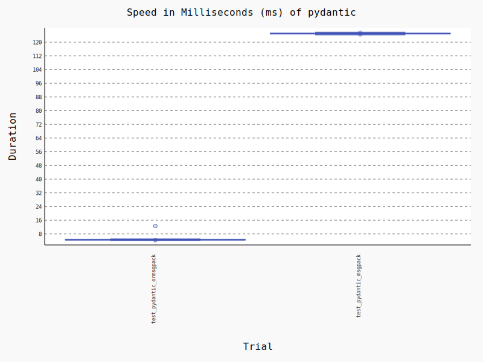
ormsgpack serializes `pydantic.BaseModel` instances natively. Currently it ignores `pydantic.BaseModel.Config`.
#### Performance

```
-------------------------------------------------------------------------------- benchmark 'pydantic': 2 tests ---------------------------------------------------------------------------------
Name (time in ms)                Min                 Max                Mean            StdDev              Median               IQR            Outliers       OPS            Rounds  Iterations
------------------------------------------------------------------------------------------------------------------------------------------------------------------------------------------------
test_pydantic_ormsgpack       4.3918 (1.0)       12.6521 (1.0)        4.8550 (1.0)      1.1455 (3.98)       4.6101 (1.0)      0.0662 (1.0)         11;24  205.9727 (1.0)         204           1
test_pydantic_msgpack       124.5500 (28.36)    125.5427 (9.92)     125.0582 (25.76)    0.2877 (1.0)      125.0855 (27.13)    0.2543 (3.84)          2;0    7.9963 (0.04)          8           1
------------------------------------------------------------------------------------------------------------------------------------------------------------------------------------------------
```
## Latency
### Graphs
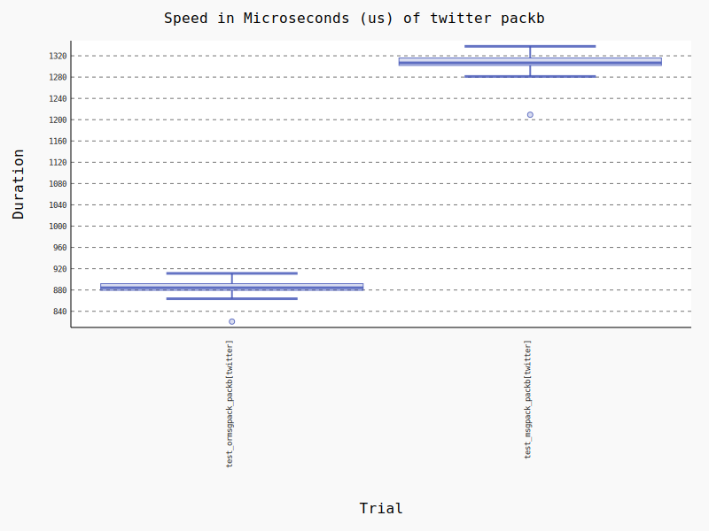
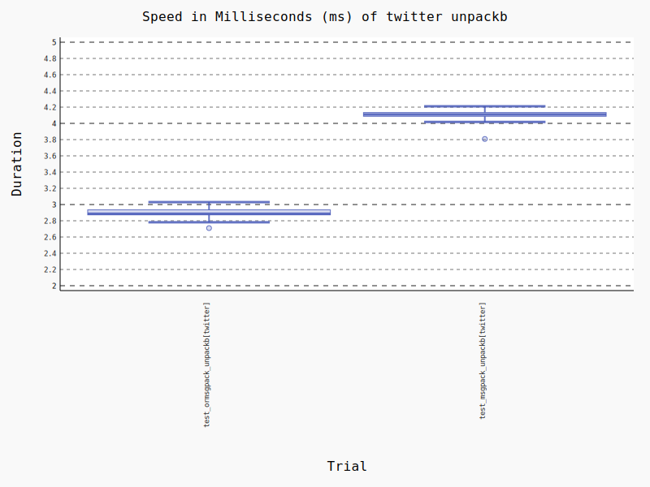
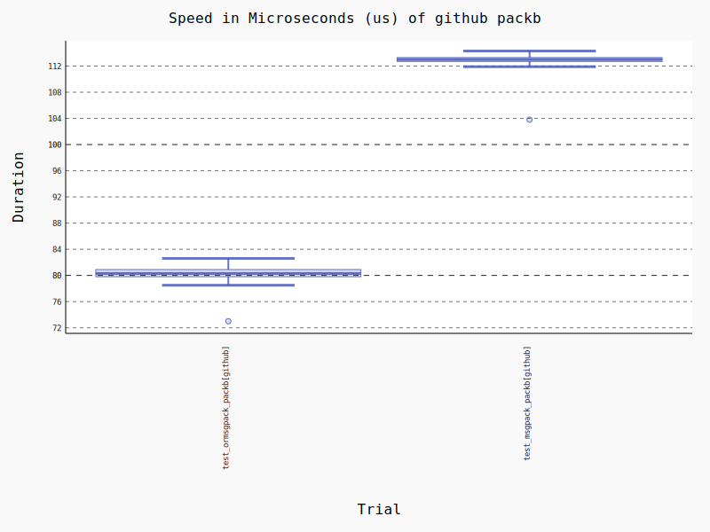
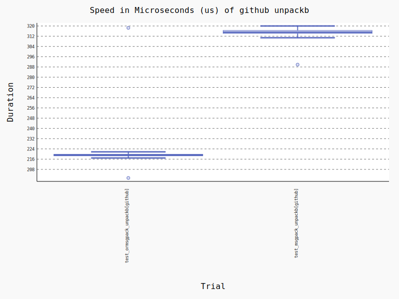
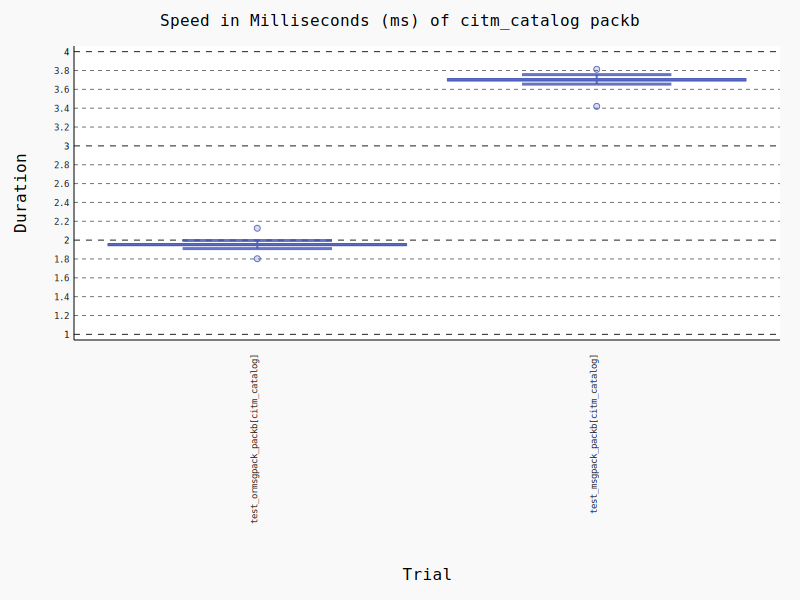
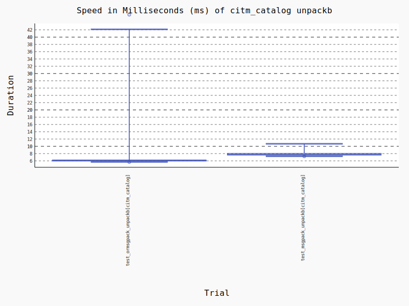
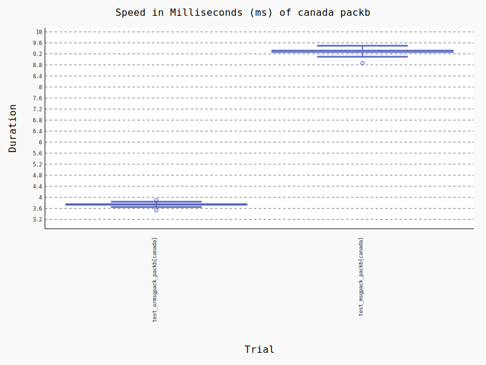
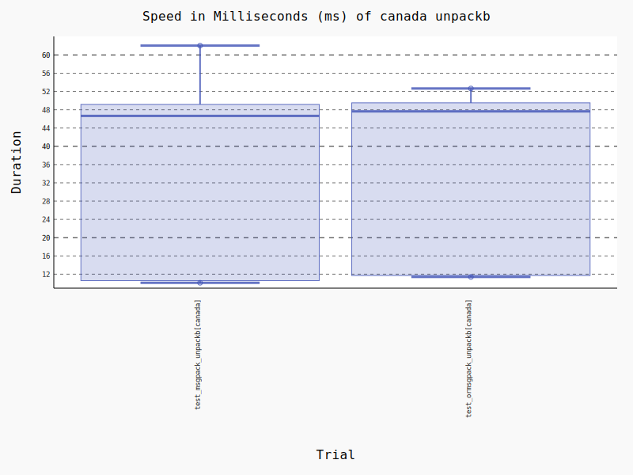
### Data
```
----------------------------------------------------------------------------- benchmark 'canada packb': 2 tests ------------------------------------------------------------------------------
Name (time in ms)                   Min                Max              Mean            StdDev            Median               IQR            Outliers       OPS            Rounds  Iterations
----------------------------------------------------------------------------------------------------------------------------------------------------------------------------------------------
test_ormsgpack_packb[canada]     3.5302 (1.0)       3.8939 (1.0)      3.7319 (1.0)      0.0563 (1.0)      3.7395 (1.0)      0.0484 (1.0)         56;22  267.9571 (1.0)         241           1
test_msgpack_packb[canada]       8.8642 (2.51)     14.0432 (3.61)     9.3660 (2.51)     0.5649 (10.03)    9.2983 (2.49)     0.0982 (2.03)         3;11  106.7691 (0.40)        106           1
----------------------------------------------------------------------------------------------------------------------------------------------------------------------------------------------


------------------------------------------------------------------------------- benchmark 'canada unpackb': 2 tests --------------------------------------------------------------------------------
Name (time in ms)                      Min                Max               Mean             StdDev             Median                IQR            Outliers      OPS            Rounds  Iterations
----------------------------------------------------------------------------------------------------------------------------------------------------------------------------------------------------
test_msgpack_unpackb[canada]       10.1176 (1.0)      62.0466 (1.18)     33.4806 (1.0)      18.8279 (1.0)      46.6582 (1.0)      38.5921 (1.02)         30;0  29.8680 (1.0)          67           1
test_ormsgpack_unpackb[canada]     11.3992 (1.13)     52.6587 (1.0)      34.1842 (1.02)     18.9461 (1.01)     47.6456 (1.02)     37.8024 (1.0)           8;0  29.2533 (0.98)         20           1
----------------------------------------------------------------------------------------------------------------------------------------------------------------------------------------------------


----------------------------------------------------------------------------- benchmark 'citm_catalog packb': 2 tests -----------------------------------------------------------------------------
Name (time in ms)                         Min               Max              Mean            StdDev            Median               IQR            Outliers       OPS            Rounds  Iterations
---------------------------------------------------------------------------------------------------------------------------------------------------------------------------------------------------
test_ormsgpack_packb[citm_catalog]     1.8024 (1.0)      2.1259 (1.0)      1.9487 (1.0)      0.0346 (1.0)      1.9525 (1.0)      0.0219 (1.0)         79;60  513.1650 (1.0)         454           1
test_msgpack_packb[citm_catalog]       3.4195 (1.90)     3.8128 (1.79)     3.6928 (1.90)     0.0535 (1.55)     3.7009 (1.90)     0.0250 (1.14)        47;49  270.7958 (0.53)        257           1
---------------------------------------------------------------------------------------------------------------------------------------------------------------------------------------------------


------------------------------------------------------------------------------ benchmark 'citm_catalog unpackb': 2 tests ------------------------------------------------------------------------------
Name (time in ms)                           Min                Max               Mean             StdDev            Median               IQR            Outliers      OPS            Rounds  Iterations
-------------------------------------------------------------------------------------------------------------------------------------------------------------------------------------------------------
test_ormsgpack_unpackb[citm_catalog]     5.6986 (1.0)      46.1843 (1.0)      14.2491 (1.0)      15.9791 (1.0)      6.1051 (1.0)      0.3074 (1.0)           5;5  70.1798 (1.0)          23           1
test_msgpack_unpackb[citm_catalog]       7.2600 (1.27)     56.6642 (1.23)     16.4095 (1.15)     16.3257 (1.02)     7.7364 (1.27)     0.4944 (1.61)        28;29  60.9404 (0.87)        125           1
-------------------------------------------------------------------------------------------------------------------------------------------------------------------------------------------------------


----------------------------------------------------------------------------------- benchmark 'github packb': 2 tests -----------------------------------------------------------------------------------
Name (time in us)                     Min                 Max                Mean            StdDev              Median               IQR            Outliers  OPS (Kops/s)            Rounds  Iterations
---------------------------------------------------------------------------------------------------------------------------------------------------------------------------------------------------------
test_ormsgpack_packb[github]      73.0000 (1.0)      215.9000 (1.0)       80.4826 (1.0)      4.8889 (1.0)       80.3000 (1.0)      1.1000 (1.83)     866;1118       12.4250 (1.0)        6196           1
test_msgpack_packb[github]       103.8000 (1.42)     220.8000 (1.02)     112.8049 (1.40)     4.9686 (1.02)     113.0000 (1.41)     0.6000 (1.0)     1306;1560        8.8649 (0.71)       7028           1
---------------------------------------------------------------------------------------------------------------------------------------------------------------------------------------------------------


----------------------------------------------------------------------------------- benchmark 'github unpackb': 2 tests -----------------------------------------------------------------------------------
Name (time in us)                       Min                 Max                Mean            StdDev              Median               IQR            Outliers  OPS (Kops/s)            Rounds  Iterations
-----------------------------------------------------------------------------------------------------------------------------------------------------------------------------------------------------------
test_ormsgpack_unpackb[github]     201.3000 (1.0)      318.5000 (1.0)      219.0861 (1.0)      6.7340 (1.0)      219.1000 (1.0)      1.2000 (1.0)       483;721        4.5644 (1.0)        3488           1
test_msgpack_unpackb[github]       289.8000 (1.44)     436.0000 (1.37)     314.9631 (1.44)     9.4130 (1.40)     315.1000 (1.44)     2.3000 (1.92)      341;557        3.1750 (0.70)       2477           1
-----------------------------------------------------------------------------------------------------------------------------------------------------------------------------------------------------------

--------------------------------------------------------------------------------------- benchmark 'twitter packb': 2 tests ---------------------------------------------------------------------------------------
Name (time in us)                        Min                   Max                  Mean             StdDev                Median                IQR            Outliers         OPS            Rounds  Iterations
------------------------------------------------------------------------------------------------------------------------------------------------------------------------------------------------------------------
test_ormsgpack_packb[twitter]       820.7000 (1.0)      2,945.2000 (2.03)       889.3791 (1.0)      78.4139 (2.43)       884.2000 (1.0)      12.5250 (1.0)          4;76  1,124.3799 (1.0)         809           1
test_msgpack_packb[twitter]       1,209.3000 (1.47)     1,451.2000 (1.0)      1,301.3615 (1.46)     32.2147 (1.0)      1,306.7000 (1.48)     14.1000 (1.13)      118;138    768.4260 (0.68)        592           1
------------------------------------------------------------------------------------------------------------------------------------------------------------------------------------------------------------------


------------------------------------------------------------------------------ benchmark 'twitter unpackb': 2 tests -----------------------------------------------------------------------------
Name (time in ms)                      Min                Max              Mean            StdDev            Median               IQR            Outliers       OPS            Rounds  Iterations
-------------------------------------------------------------------------------------------------------------------------------------------------------------------------------------------------
test_ormsgpack_unpackb[twitter]     2.7097 (1.0)      41.1530 (1.0)      3.2721 (1.0)      3.5860 (1.03)     2.8868 (1.0)      0.0614 (1.32)         4;38  305.6098 (1.0)         314           1
test_msgpack_unpackb[twitter]       3.8079 (1.41)     42.0617 (1.02)     4.4459 (1.36)     3.4893 (1.0)      4.1097 (1.42)     0.0465 (1.0)          2;54  224.9267 (0.74)        228           1
-------------------------------------------------------------------------------------------------------------------------------------------------------------------------------------------------
```
### Reproducing

The above was measured using Python 3.7.9 on Azure Linux VM (x86_64) with ormsgpack 0.2.1 and msgpack 1.0.2.

The latency results can be reproduced using `./scripts/benchmark.sh` and graphs using
`pytest --benchmark-histogram benchmarks/bench_*`.
## Questions

### Why can't I install it from PyPI?

Probably `pip` needs to be upgraded. `pip` added support for `manylinux2014`
in 2019.

### Will it deserialize to dataclasses, UUIDs, decimals, etc or support object_hook?

No. This requires a schema specifying what types are expected and how to
handle errors etc. This is addressed by data validation libraries a
level above this.

### Will it support PyPy?

If someone implements it well.

## Packaging

To package ormsgpack requires [Rust](https://www.rust-lang.org/) on the
 nightly channel and the [maturin](https://github.com/PyO3/maturin)
build tool. maturin can be installed from PyPI or packaged as
well. This is the simplest and recommended way of installing
from source, assuming `rustup` is available from a
package manager:

```sh
rustup default nightly
pip wheel --no-binary=ormsgpack ormsgpack
```

This is an example of building a wheel using the repository as source,
`rustup` installed from upstream, and a pinned version of Rust:

```sh
pip install maturin
curl https://sh.rustup.rs -sSf | sh -s -- --default-toolchain nightly-2021-05-25 --profile minimal -y
maturin build --no-sdist --release --strip --manylinux off
ls -1 target/wheels
```

Problems with the Rust nightly channel may require pinning a version.
`nightly-2021-05-25` is known to be ok.

ormsgpack is tested for amd64 and aarch64 on Linux, macOS, and Windows. It
may not work on 32-bit targets. It has recommended `RUSTFLAGS`
specified in `.cargo/config` so it is recommended to either not set
`RUSTFLAGS` or include these options.

There are no runtime dependencies other than libc.

## License

orjson was written by ijl <<ijl@mailbox.org>>, copyright 2018 - 2021, licensed
under both the Apache 2 and MIT licenses.

ormsgpack was forked from orjson and is maintained by Aviram Hassan <<aviramyhassan@gmail.com>>, licensed
same as orjson.